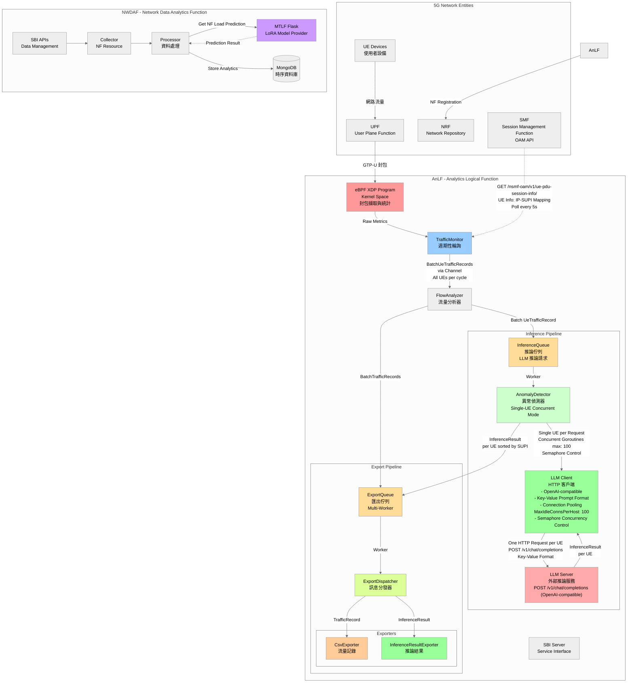
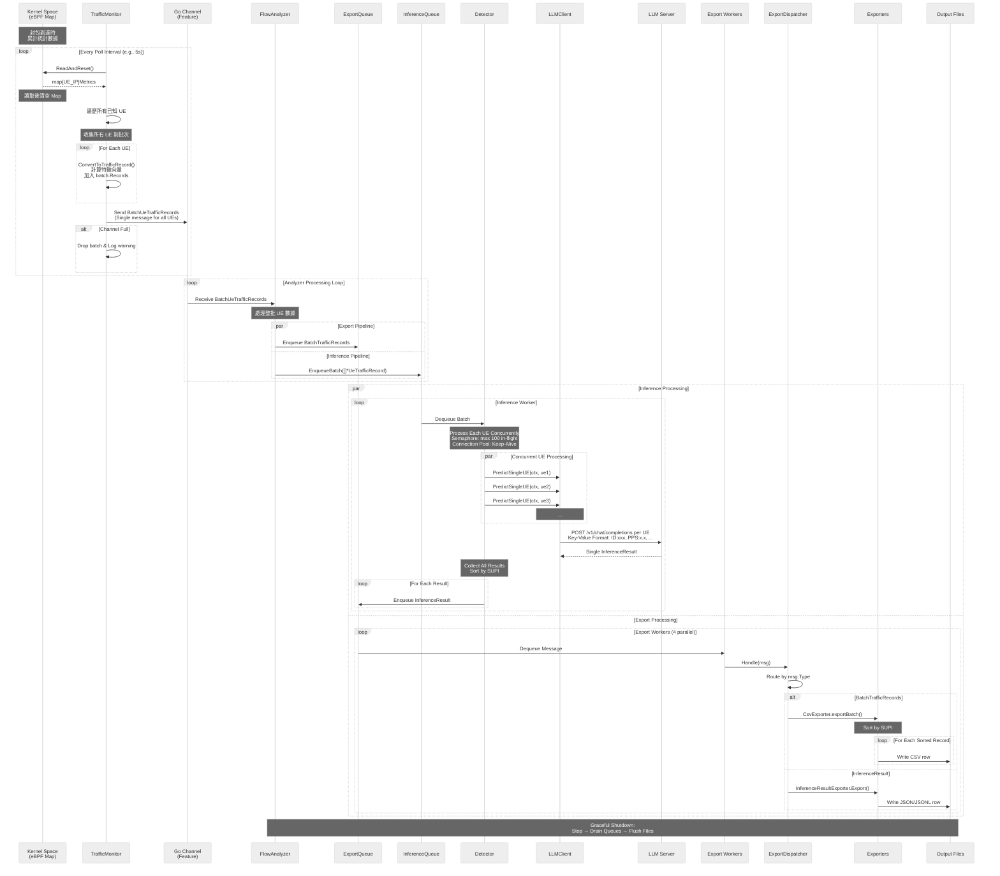
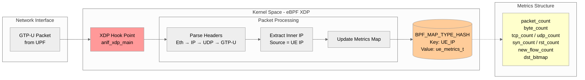
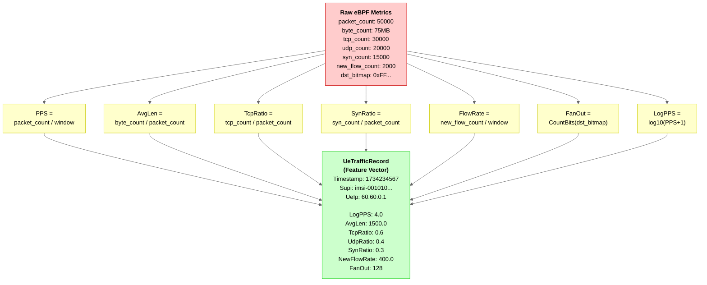
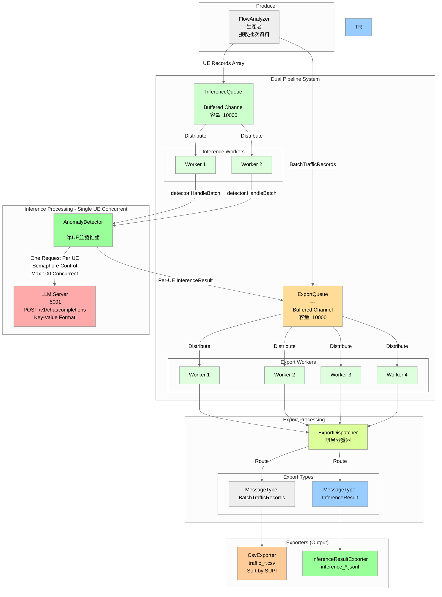
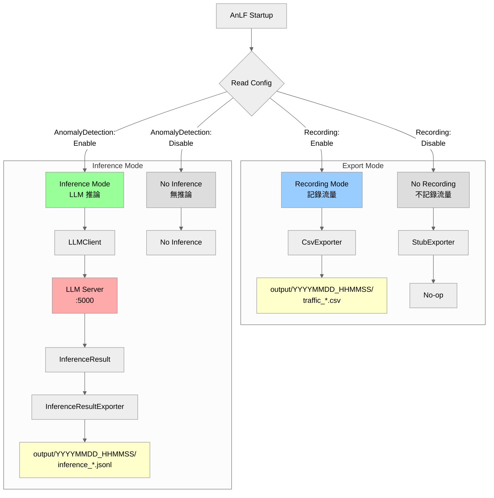
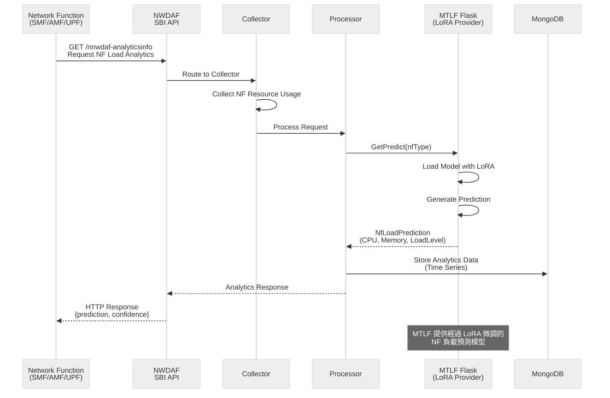
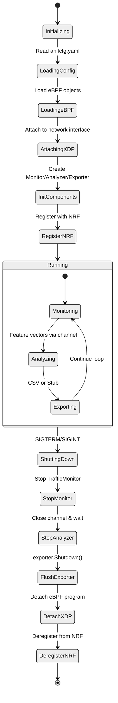

# AnLF 系統架構與資料流向

## 1. 系統總覽 (System Overview)



## 2. AnLF 內部資料流管道 (Internal Data Pipeline)



## 3. eBPF 資料收集層 (eBPF Data Collection Layer)



## 4. 特徵工程轉換 (Feature Engineering)



## 5. Message Queue 架構 (Message Queue Architecture - Dual Pipeline)

### 5.1 Export Queue 與 Inference Queue 雙管道



### 5.2 Message Types

```go
// ExportMessage - 匯出管道訊息
type ExportMessage struct {
    Type MessageType  // "traffic_record" 或 "inference_result"
    Data interface{}  // 實際資料
}

// MessageType - 訊息類型
const (
    MessageTypeTrafficRecord    = "traffic_record"      // 流量記錄
    MessageTypeInferenceResult  = "inference_result"    // 推論結果
)
```

### 5.3 特性

#### Export Queue
- **用途**: 匯出流量記錄和推論結果
- **容量**: 10000 訊息
- **Workers**: 4 個並行 worker
- **Handler**: ExportDispatcher
- **消費者**: CsvExporter, InferenceResultExporter

#### Inference Queue
- **用途**: 推論佇列
- **容量**: 10000 訊息
- **Workers**: 2 個並行 worker (可調整)
- **Handler**: AnomalyDetector
- **處理**: HTTP POST 到 LLM Server

#### 消息路由

```
FlowAnalyzer
    ├── → ExportQueue
    │       └── ExportDispatcher.Handle()
    │           ├── TrafficRecord → CsvExporter → traffic_*.csv
    │           └── InferenceResult → InferenceResultExporter → inference_*.jsonl
    │
    └── → InferenceQueue (if enabled)
            └── AnomalyDetector.Handle()
                ├── LLMClient.Predict() → LLM Server :5000
                └── InferenceResult → ExportQueue
```

## 6. 雙模式運作流程 (Dual-Mode Operation)



## 6.1 CSV 輸出格式 ✨ **更新 (2025-12-17)**

### Traffic CSV 格式
CsvExporter 輸出的 traffic_*.csv 檔案包含以下欄位：

```csv
timestamp,supi,ue_ip,log_pps,avg_len,tcp_ratio,udp_ratio,icmp_ratio,syn_ratio,rst_ratio,new_flow_rate,fan_out,global_avg_pps,global_avg_flow_rate,global_avg_len
1734417600,imsi-001010000000001,60.60.0.1,4.523,1480.5,0.85,0.15,0.0,0.12,0.03,350.2,45,3.845,285.6,1200.3
1734417600,imsi-001010000000002,60.60.0.2,3.201,850.0,0.92,0.08,0.0,0.08,0.01,120.5,12,3.845,285.6,1200.3
```

### 欄位說明

#### UE 識別欄位
- **timestamp**: Unix 時戳 (秒)
- **supi**: UE 識別碼 (例如: imsi-001010000000001)
- **ue_ip**: UE IP 地址 (例如: 60.60.0.1)

#### UE 個別特徵欄位
- **log_pps**: Log10(Packets Per Second + 1) - 流量規模
- **avg_len**: 平均封包大小 (bytes)
- **tcp_ratio**: TCP 封包比例 (0.0-1.0)
- **udp_ratio**: UDP 封包比例 (0.0-1.0)
- **icmp_ratio**: ICMP 封包比例 (0.0-1.0)
- **syn_ratio**: TCP SYN 旗標比例 (0.0-1.0)
- **rst_ratio**: TCP RST 旗標比例 (0.0-1.0)
- **new_flow_rate**: 新連線率 (connections/sec)
- **fan_out**: 目標地址分散度 (0-256)

#### 全域統計欄位 ✨ **新增 (2025-12-17)**
- **global_avg_pps**: 全域平均 Log10(PPS) - 該批次所有活躍 UE 的平均值
- **global_avg_flow_rate**: 全域平均新連線率 - 該批次所有活躍 UE 的平均值
- **global_avg_len**: 全域平均封包大小 - 該批次所有活躍 UE 的平均值

### 全域統計計算規則
- 在每個 Poll 週期，FlowAnalyzer 計算所有**活躍** UE (packet_count > 0) 的平均值
- 同一批次的所有 UE 記錄共用相同的全域統計數據
- 全域統計數據會填充到每一條 UeTrafficRecord 中
- 如果某批次無活躍 UE，則全域統計欄位為 0.0

### 輸出特性
- **排序**: 記錄按 SUPI 字母順序排序輸出
- **批次寫入**: 每個 Poll 週期的所有 UE 資料一次性寫入
- **檔案命名**: `output/YYYYMMDD_HHMMSS/traffic_YYYYMMDD_HHMMSS.csv`

## 7. NWDAF 資料流 (NWDAF Data Flow)



## 8. 系統生命週期管理 (Lifecycle Management)



## 9. 關鍵資料結構 (Key Data Structures)

### eBPF Map Value (Kernel)
```c
struct ue_metrics_t {
    u64 packet_count;      // 總封包數
    u64 byte_count;        // 總位元組數
    u64 tcp_count;         // TCP 封包數
    u64 udp_count;         // UDP 封包數
    u64 icmp_count;        // ICMP 封包數
    u64 syn_count;         // TCP SYN 封包數
    u64 rst_count;         // TCP RST 封包數
    u64 new_flow_count;    // 新連線數
    u64 dst_bitmap;        // 目標 IP 分散度 (Bitmap)
};
```

### Feature Vector (User Space)
```go
type UeTrafficRecord struct {
    Timestamp   int64   // Unix timestamp
    Supi        string  // UE identifier
    UeIp        string  // UE IP address
    
    // Normalized features
    LogPPS      float64 // log10(PPS + 1)
    AvgLen      float64 // Average packet length
    TcpRatio    float64 // TCP packet ratio
    UdpRatio    float64 // UDP packet ratio
    IcmpRatio   float64 // ICMP packet ratio
    SynRatio    float64 // TCP SYN ratio
    RstRatio    float64 // TCP RST ratio
    NewFlowRate float64 // New flows per second
    FanOut      float64 // Destination diversity (0-256)
    
    // Global network statistics (for context) ✨ 新增 (2025-12-17)
    GlobalAvgPPS      float64 // 全域平均 Log10(PPS)
    GlobalAvgFlowRate float64 // 全域平均新連線率
    GlobalAvgLen      float64 // 全域平均封包大小
}
```

### Single-UE Processing Data Structures
```go
// 單一 UE 推論結果
type InferenceResult struct {
    UeIp         string  `json:"ue_ip"`          // UE IP
    Supi         string  `json:"supi"`           // UE identifier
    Timestamp    int64   `json:"timestamp"`      // 時戳
    IsAnomaly    bool    `json:"is_anomaly"`     // 是否異常
    AnomalyScore float64 `json:"anomaly_score"` // 0.0-1.0
    Prediction   string  `json:"prediction"`     // "normal" 或 "attack"
    Confidence   float64 `json:"confidence"`     // 0.0-1.0
    ModelVersion string  `json:"model_version"`  // 模型版本
}
```

### Global Network Statistics ✨ **新增 (2025-12-16)**
```go
// 全域網路統計 (每個 Poll 週期計算一次)
type GlobalNetworkStats struct {
    AvgLogPPS   float64 `json:"avg_log_pps"`   // 平均 Log10(PPS)
    AvgFlowRate float64 `json:"avg_flow_rate"` // 平均新連線率
    AvgLen      float64 `json:"avg_len"`       // 平均封包大小
}

// BatchUeTrafficRecords 包含全域統計
type BatchUeTrafficRecords struct {
    Records     []*UeTrafficRecord   `json:"records"`
    Timestamp   int64                `json:"timestamp"`
    BatchSize   int                  `json:"batch_size"`
    PollID      uint64               `json:"poll_id"`
    GlobalStats *GlobalNetworkStats  `json:"global_stats"` // ✨ 新增
}
```

**全域統計功能說明:**
- FlowAnalyzer 在 `processBatch()` 階段計算所有 UE 的平均值
- 每個 poll 週期的所有 UE 共用相同的全域統計資料
- 可透過 `includeGlobalContext: true` 配置啟用
- 用於 LLM prompt 中提供網路整體狀態資訊
- 幫助 LLM 識別異常 UE（與平均值偏離過大）

### Export Message Structure
```go
type ExportMessage struct {
    Type MessageType  // "batch_traffic_records" 或 "inference_result"
    Data interface{}  // 實際資料內容
}

// 範例：批次流量記錄訊息 (含全域統計)
{
    Type: "batch_traffic_records",
    Data: &BatchUeTrafficRecords{
        Records: []*UeTrafficRecord{
            {Timestamp: 1702649400, Supi: "imsi-001010000000001", UeIp: "60.60.0.1", ...},
            {Timestamp: 1702649400, Supi: "imsi-001010000000002", UeIp: "60.60.0.2", ...},
            ...
        },
        Timestamp: 1702649400,
        BatchSize: 20,
        GlobalStats: &GlobalNetworkStats{  // ✨ 新增
            AvgLogPPS:   3.2,
            AvgFlowRate: 0.3,
            AvgLen:      650.0,
        },
    }
}

// 範例：推論結果訊息（單一 UE）
{
    Type: "inference_result",
    Data: &InferenceResult{
        UeIp:         "60.60.0.1",
        Supi:         "imsi-001010000000001",
        Timestamp:    1702649400,
        IsAnomaly:    true,
        AnomalyScore: 0.85,
        Prediction:   "attack",
        Confidence:   0.92,
        ModelVersion: "v1.0",
    }
}
```

### Configuration (YAML)
```yaml
configuration:
  # ... 其他配置 ...
  
  # 異常檢測配置
  anomalyDetection:
    enable: true                          # 啟用異常檢測
    serverUrl: "http://127.0.0.1:5000"   # LLM 推論伺服器
    timeout: 5                            # 超時時間 (秒)
```

## 10. 效能考量與設計決策

### eBPF 層
- **XDP Hook**: 在網路堆疊最早期攔截封包，延遲最低
- **Per-UE Map**: 使用 HASH Map 支援動態 UE 數量
- **Atomic Updates**: eBPF 內建原子操作，無需額外鎖

### User Space 層
- **Non-blocking Channel**: 防止 eBPF 讀取被阻塞
- **ReadAndReset()**: 原子讀取後清空，避免重複計數
- **Batch Channel**: 128 容量緩衝 (批次模式，每訊息包含多個 UE)
- **Batch Processing**: 所有 UE 數據打包為單一批次，減少通道操作與鎖競爭

### Export Message Queue
- **Large Buffer**: 10000 訊息容量，處理高流量突發
- **Multi-Worker**: 4 個並行 goroutines，提升吞吐量
- **Type-based Routing**: 根據 MessageType 動態分發到不同 exporter
  - `batch_traffic_records`: 批次流量記錄，CsvExporter 按 SUPI 排序後寫入
  - `inference_result`: 單一 UE 推論結果
- **Batch CSV Export**: CsvExporter 接收批次後按 SUPI 排序，確保輸出順序一致
- **Graceful Drain**: 關閉時確保所有佇列訊息都被處理
- **Monitoring**: 每 30 秒報告佇列利用率，超過 80% 發出警告

### Inference Queue (LLM Pipeline)
- **Batch Inference**: 使用 OpenAI-compatible Chat Completions API 批次推論，並可視情況拆分為多個子批次以避免模型輸出截斷或格式錯誤
    - 原架構: N 個 UE × 每秒 → N 個 HTTP 請求/秒
    - 批次架構: N 個 UE × 每秒 → 少量 HTTP 請求/秒（採 sub-batches）
- **Dynamic Batch Size**: 批次大小依實際 UE 數量動態調整，配置參數 `batchSize`（建議 5-10）
- **Endpoint**: 使用 `POST /v1/chat/completions`（OpenAI-compatible），請求中採用 `json_schema` 與 One-Shot system prompt 以強制穩定 JSON 輸出；`max_tokens` 增加以避免截斷
- **Result Distribution**: 批次推論結果（每個子批次）回傳後拆分為個別 UE 結果，逐一寫入 ExportQueue

### 資料完整性
- **Zero-filling**: 沒有流量的 UE 也會產生零值記錄
- **Graceful Shutdown**: 確保 CSV 完整 flush，無資料遺失
- **Queue Persistence**: 關閉時先停止生產者，再 drain 完所有訊息

---

---

## 補充說明

### AnLF 當前實作狀態

#### ✅ 已完全實作

1. **eBPF 層**
   - XDP Hook 在 UPF GTP-U 流量上
   - Per-UE 流量統計與特徵萃取
   - 原子操作確保資料一致性

2. **SMFClient** ✨ **新增真實 SMF API 整合 (2025-12-16)**
   - 定期從 SMF OAM API 獲取 UE 資訊
   - API 端點: GET /nsmf-oam/v1/ue-pdu-session-info/
   - 輪詢間隔: 5 秒 (可配置)
   - 維護 UE IP 到 SUPI 的對照表
   - 自動處理 SMF 無 Session 情況 (404 響應)
   - 支持優雅關閉 (實現 Lifecycle 接口)

3. **TrafficMonitor**
   - 定期輪詢 eBPF Map (預設 1-5 秒)
   - 從 SMFClient 獲取 UE SUPI 資訊
   - 特徵向量計算與正規化
   - Go Channel 生產者

4. **FlowAnalyzer**
   - 特徵向量消費者
   - 雙管道分發:
     - ExportQueue: 流量記錄
     - InferenceQueue: LLM 推論請求

5. **ExportQueue & ExportDispatcher**
   - 10000 容量 buffered channel
   - 4 個並行 worker
   - 訊息類型路由
   - CsvExporter (流量記錄)
   - InferenceResultExporter (推論結果)

6. **InferenceQueue & AnomalyDetector** ✨ **單UE並發處理**
   - 10000 容量 buffered channel
   - 2 個並行 worker (可配置)
   - LLMClient HTTP 客戶端 (優化版)
    - 向外部 LLM Server POST /v1/chat/completions (OpenAI-compatible)
    - **每個UE發送一個獨立請求** (Key-Value格式)
    - 連接池優化: MaxIdleConnsPerHost=100, Keep-Alive enabled
    - 信號量控制: 最多100個並發請求
    - Regex解析: 容錯提取風險分數
   - 結果逐一寫回 ExportQueue

7. **配置系統**
   - YAML 配置文件
   - smf 段落: ✨ **新增**
     - url: SMF OAM API 基礎 URL (預設: http://127.0.0.2:8000)
     - pollInterval: 輪詢間隔秒數 (預設: 5)
   - anomalyDetection 段落:
     - enable: 啟用/停用
8    - serverUrl: LLM 伺服器地址
     - timeout: 推論超時

7. **生命週期管理**
   - Graceful shutdown
9. **完整測試** ✨ **更新至 Single-UE 架構 + SMF Client**
   - BaseQueue 測試 (4 tests)
   - ExportQueue 測試 (4 tests)
   - InferenceQueue 測試 (2 tests)
   - LLMClient 測試 (5 tests) - 包含 PredictSingleUE 測試
   - AnomalyDetector 測試 (3 tests) - 單UE並發處理測試
   - SMFClient 測試 (5 tests) ✨ **新增** - API 解析、輪詢、生命週期測試
   - **總計 23ceQueue 測試 (2 tests)
10  - LLMClient 測試 (5 tests) - 包含 PredictSingleUE 測試
   - AnomalyDetector 測試 (3 tests) - 單UE並發處理測試
   - **總計 18 個測試全通過**

9. **Prompt Preview 工具** ✨ **新增單UE模式**
   - 支援單UE預覽模式 (`-single` flag)
   - 顯示 Key-Value 格式的 prompt
   - 統計資訊包含 token 優化說明

#### 📋 組件清單

| 組件 | 狀態 | 說明 |
|------|------|------|
| eBPF XDP | ✅ | 核心封包擷取層 |
| SMFClient | ✅ | SMF OAM API 客戶端 ✨ |
| TrafficMonitor | ✅ | 特徵監控與計算 |
| FlowAnalyzer | ✅ | 雙管道分發 |
| ExportQueue | ✅ | 匯出佇列 |
| ExportDispatcher | ✅ | 訊息路由 |
| CsvExporter | ✅ | CSV 匯出 |
| InferenceQueue | ✅ | 推論佇列 |
| AnomalyDetector | ✅ | LLM 推論 |
| LLMClient | ✅ | HTTP 客戶端 |
| InferenceResultExporter | ✅ | 推論結果匯出 |
| LifecycleManager | ✅ | 優雅關閉 |

#### 🔧 配置要點

```yaml
smf:  # ✨ 新增 SMF 配置
  url: "http://127.0.0.2:8000"                          # SMF OAM API URL
  pollInterval: 5                                        # 輪詢間隔 (秒)

anomalyDetection:
  enable: true                                           # 啟用異常檢測
  serverUrl: "http://127.0.0.1:5000"                    # LLM 服務地址
  timeout: 5                                             # 請求超時 (秒)
  maxConcurrent: 100                                     # 最大並發請求數 (預設: 100)
  systemPromptPath: ./prompts/anomaly_detection_single_ue.txt  # 單UE提示詞模板
  includeGlobalContext: true                             # 包含全域網路統計 (預設: false)
```

**效能優化特性** ✨ **最新版本 (2025-12-16) - Single-UE Concurrent Architecture**

1. **單UE並發請求 (Single-UE Concurrent Requests)**
   - 每個UE發送一個獨立的HTTP請求
   - 使用信號量 (Semaphore) 控制並發數量 (預設: 100)
   - 避免瞬間請求過多導致服務器擁塞

2. **連接池優化 (Connection Pooling)**
   - MaxIdleConns: 1000 (允許大量閒置連接)
   - MaxIdleConnsPerHost: 100 (關鍵: 必須 >= 並發目標)
   - Keep-Alive 啟用，重用TCP連接
   - 參考: high_speed_HTTPclient.md

3. **Template-Based Prompt格式** ✨ **新增全域統計支援 (2025-12-16)**
   - 使用佔位符 (Placeholder) 模板格式: `{supi}`, `{log_pps}`, `{global_avg_pps}` 等
   - 支援全域網路統計 (Global Network Context):
     - `{global_avg_pps}`: 所有UE的平均Log10(PPS)
     - `{global_avg_flow}`: 所有UE的平均新連線率
     - `{global_avg_len}`: 所有UE的平均封包大小
   - 可通過 `includeGlobalContext` 配置啟用/停用全域統計
   - 動態填入每次poll的全域資料，同批次UE共用相同全域統計
   - 每個請求僅需 ~10 output tokens

4. **Fail-Open 機制**
   - LLM 推論失敗時自動返回 "Normal" 預設結果 (score: 0.1)
   - Regex容錯解析: 從LLM輸出提取風險分數
   - 避免網路流量因推論錯誤而中斷
   - 記錄錯誤但繼續運作，確保系統可用性

5. **結果排序 (SUPI-based Sorting)**
   - 推論結果按 SUPI 排序後輸出
   - 確保輸出檔案順序一致，便於分析

6. **性能指標追蹤**
   - 記錄每批次的處理時間和吞吐量
   - 日誌格式: `Batch complete: N UEs analyzed in Xms (Y.YY req/s)`

**啟用異常檢測的步驟:**
1. 修改 config/anlfcfg.yaml:
     ```yaml
     anomalyDetection:
         enable: true
         serverUrl: "http://127.0.0.1:5000"   # OpenAI-compatible LLM server base URL
         timeout: 5
         maxConcurrent: 100                    # 最大並發請求數 (根據服務器性能調整)
         systemPromptPath: ./prompts/anomaly_detection_single_ue.txt
         includeGlobalContext: true            # 啟用全域網路統計 (可選)
     ```

2. 啟動 LLM 推論伺服器:
    ```bash
    # 服務必須在指定地址監聽
    # 實作 POST /v1/chat/completions 端點 (OpenAI-compatible Chat Completions)
    # 實作 GET /health 端點
    # 建議使用 -np 參數控制並發處理能力 (例如: -np 100)
   
    # 範例：啟動高性能 LLM server
    cd test_LLM_server
    python3 llm_server.py -m Qwen/Qwen2.5-1.5B-Instruct -np 100
    ```

3. 啟動 AnLF:
   ```bash
   ./bin/anlf -cfg config/anlfcfg.yaml
   ```

4. 使用 prompt_preview 工具測試:
   ```bash
   # 預覽帶全域統計的 prompt
   ./bin/prompt_preview -prompt ./prompts/anomaly_detection_single_ue.txt -global=true
   
   # 預覽不帶全域統計的 prompt
   ./bin/prompt_preview -prompt ./prompts/anomaly_detection_single_ue.txt -global=false
   
   # 只顯示 system prompt
   ./bin/prompt_preview -prompt ./prompts/anomaly_detection_single_ue.txt -system-only
   
   # 只顯示 user prompt
   ./bin/prompt_preview -prompt ./prompts/anomaly_detection_single_ue.txt -user-only
   ```

### Prompt 模板格式 ✨ **Template-Based (2025-12-16)**

AnLF 現在使用佔位符 (Placeholder) 模板格式，支援動態替換：

**System Prompt 模板 (`prompts/anomaly_detection_single_ue.txt`):**
```
You are a Network Security Analyst for a 5G Core Network.
Your task is to detect DoS attacks by analyzing single UE traffic patterns.

Global Network Context (Current Window):
- Global Avg PPS: {global_avg_pps}
- Global Avg Flow Rate: {global_avg_flow}
- Global Avg Packet Size: {global_avg_len}

Input Field Definitions:
...

User Data: PPS:{log_pps}, Len:{avg_len}, Flow:{flow_rate}, Fan:{fan_out}, TCP:{tcp_ratio}, SYN:{syn_ratio}, RST:{rst_ratio}
```

**支援的佔位符:**
- **全域統計:** `{global_avg_pps}`, `{global_avg_flow}`, `{global_avg_len}`
- **UE 特定:** `{log_pps}`, `{avg_len}`, `{flow_rate}`, `{fan_out}`, `{tcp_ratio}`, `{syn_ratio}`, `{rst_ratio}`

**運行時替換示例:**
```
Global Network Context (Current Window):
- Global Avg PPS: 3.20
- Global Avg Flow Rate: 0.30
- Global Avg Packet Size: 650

User Data: PPS:5.0, Len:512, Flow:0.90, Fan:5, TCP:0.6, SYN:0.1, RST:0.0
```

**特性:**
- 模板與資料分離，易於修改 prompt
- 支援條件式啟用全域統計（`includeGlobalContext` 配置）
- 最後一行 "User Data:" 作為 user prompt，其餘為 system prompt
- 佔位符格式統一使用 `{key}` 格式

### 資料流完整版本

```
[GTP-U Packets from UPF]
        ↓
    [eBPF XDP]
        ↓
    [eBPF Map: UE → Metrics]
        ↓
[TrafficMonitor - Poll Every 1-5s]
        ↓ (收集所有 UE 為單一批次)
    [Feature Channel] (capacity: 128, BatchUeTrafficRecords)
        ↓
[FlowAnalyzer - Process Batch]
    ├─→ [ExportQueue] (BatchTrafficRecords 消息)
    │       ├─ 4 Workers → [ExportDispatcher] 
    │       │   ├─→ BatchTrafficRecords → [CsvExporter]
    │       │   │       └─→ Sort by SUPI → traffic_*.csv
    │       │   └─→ InferenceResult → [InferenceResultExporter] → inference_*.jsonl
    │       └─ Buffered Channel (capacity: 10000)
    │
    └─→ [InferenceQueue] (if enabled, []*UeTrafficRecord)
            ├─ 2 Workers → [AnomalyDetector.HandleBatch]
            │   ├─→ Semaphore控制 (max 100 in-flight)
            │   ├─→ For Each UE: Spawn Goroutine
            │   │   ├─→ [LLMClient.PredictSingleUE(ctx, ue)]
            │   │   │   └─→ POST http://127.0.0.1:5001/v1/chat/completions
            │   │   │       (Key-Value Format: PPS:x.x, Len:xxx, ...)
            │   │   │       ↓
            │   │   │   [LLM Server] (每UE一個請求)
            │   │   │       ↓
            │   │   │   InferenceResult (Regex提取風險分數)
            │   │   └─→ Collect Result
            │   ├─→ Wait All Goroutines
            │   ├─→ Sort Results by SUPI
            │   └─→ [ExportQueue] (feedback loop, per UE)
            └─ Buffered Channel (capacity: 10000)
            
    ✨ 連接池優化: MaxIdleConnsPerHost=100, Keep-Alive=true
    ✨ 並發控制: Semaphore限制最多100個並行請求
    ✨ 容錯處理: Regex解析 + Fail-Open機制
```

### SMF Client 整合 ✨ **新增 (2025-12-16)**

**功能說明**
- **目的**: 從真實 SMF 獲取 UE PDU Session 資訊，取代靜態配置文件
- **API**: GET /nsmf-oam/v1/ue-pdu-session-info/
- **資料結構**: 維護 UE IP → SUPI 的對照表

**運作流程**
1. **初始化**: 建立 HTTP 客戶端，設定 SMF URL 和輪詢間隔
2. **啟動**: 立即發起第一次 API 請求，隨後啟動定期輪詢 goroutine
3. **輪詢**: 每 N 秒向 SMF 請求一次 UE 資訊
4. **解析**: 從 JSON 響應中提取 pduAddress (UE IP) 和 supi
5. **更新**: 原子性更新內部 UE 對照表
6. **關閉**: 接收停止信號後優雅退出輪詢 goroutine

**容錯處理**
- **404 響應**: SMF 無 Session 時返回 404，客戶端清空 UE 表並繼續運行
- **網路錯誤**: 記錄警告但不中斷服務，等待下次輪詢重試
- **部分資料**: 自動過濾缺少 IP 或 SUPI 的 Session

**介面實現**
```go
type UeDataProvider interface {
    GetSupi(ueIp string) string
    GetUeCount() int
    GetAllUeIps() []string
}
```
- **MockSMF**: 從靜態 JSON 文件加載 (用於測試)
- **SMFClient**: 從真實 SMF API 動態獲取 (生產環境)

**日誌輸出**
- 啟動時: 顯示 SMF URL 和輪詢間隔
- 每次成功獲取: 顯示 UE 數量 (例如: "Successfully fetched 20 UE entries from SMF")
- 錯誤時: 記錄詳細錯誤信息

**配置範例**
```yaml
smf:
  url: http://127.0.0.2:8000     # SMF OAM API 基礎 URL
  pollInterval: 5                 # 每 5 秒請求一次
```

### NWDAF & MTLF
- **MTLF 角色**: 提供經過 LoRA 微調的 NF 負載預測模型
- **主要用途**: 預測 5G Network Functions (SMF/AMF/UPF) 的資源使用狀況
- **預測指標**: CPU Usage, Memory Usage, Load Level Average/Peak
- **模型架構**: Flask Server + LoRA Fine-tuned Models

---