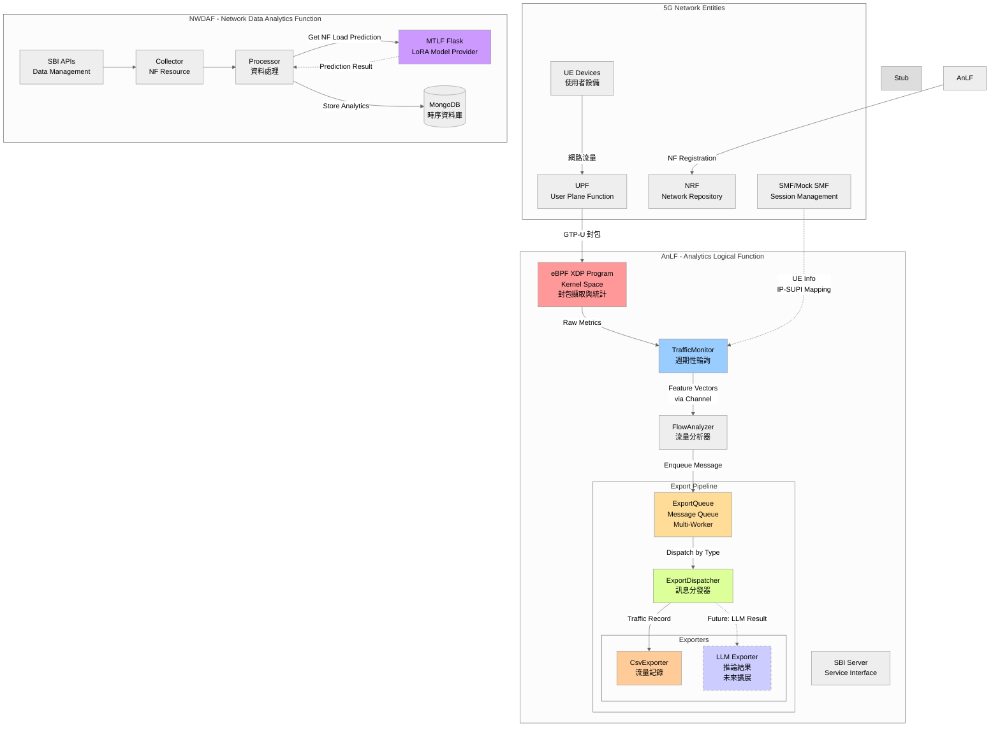
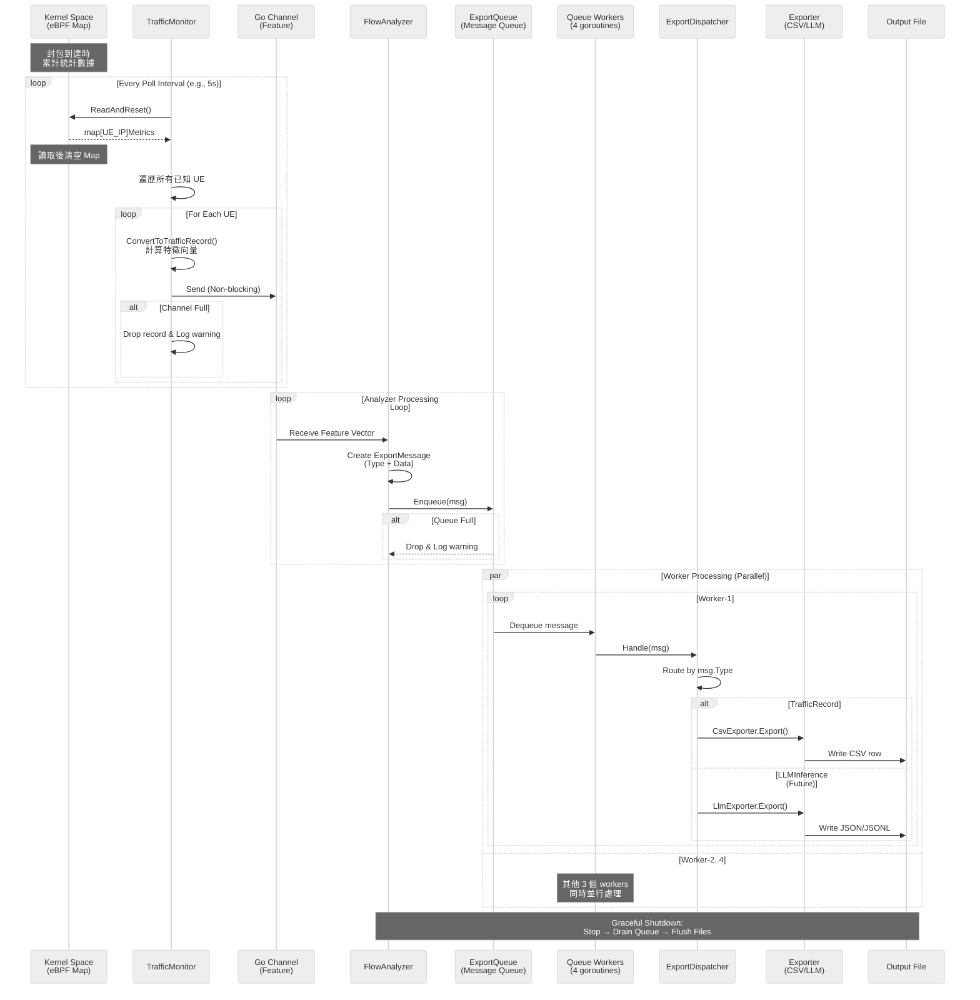
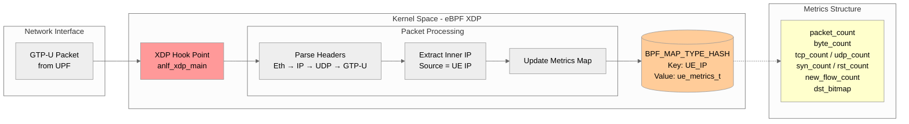
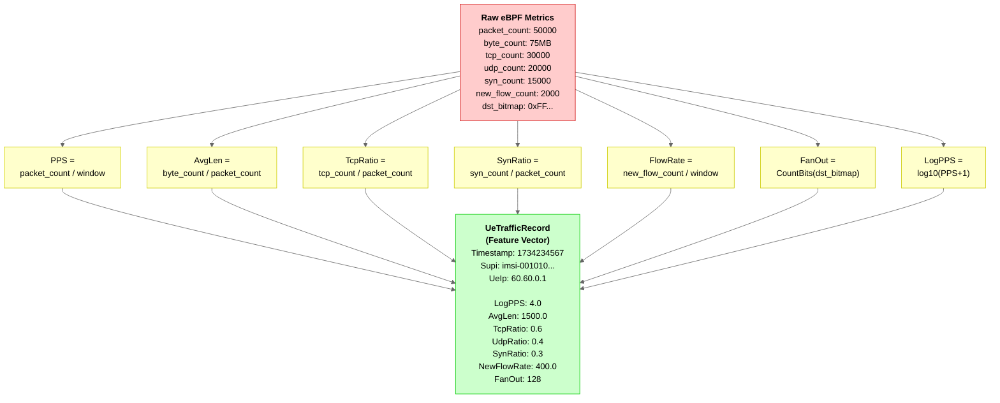
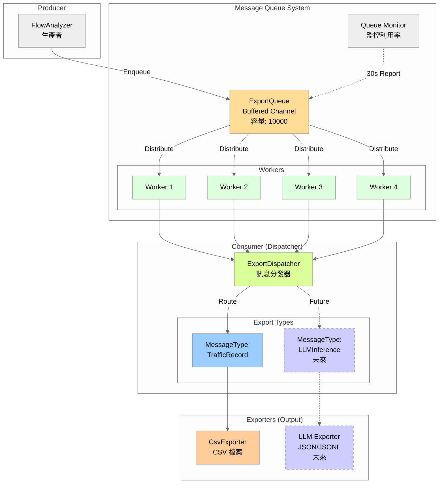
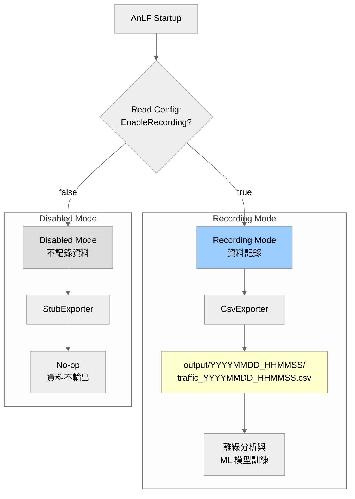
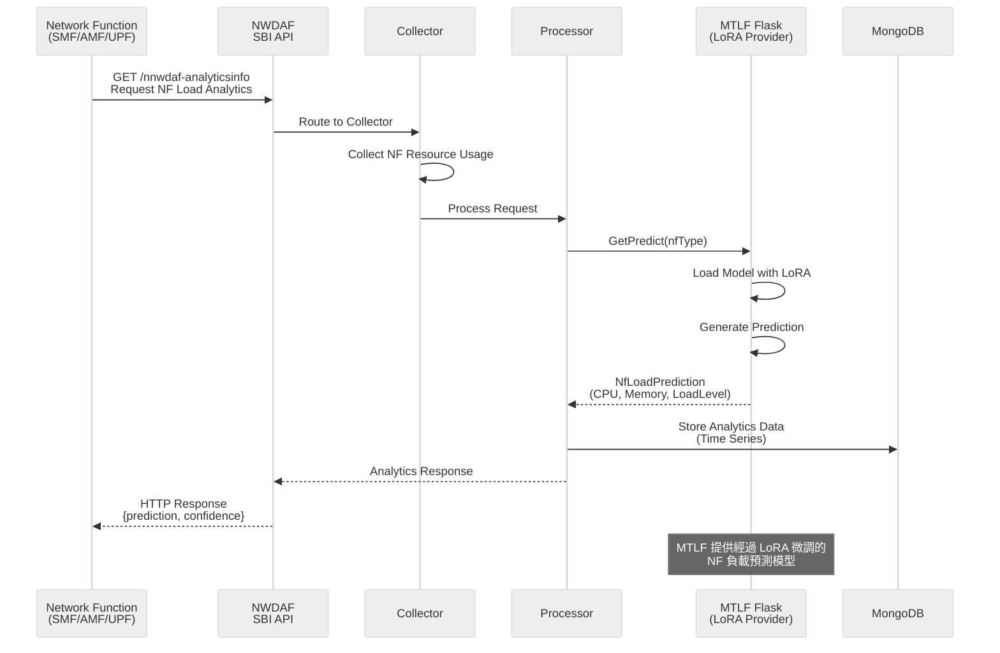
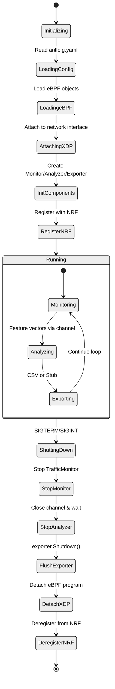

# AnLF 系統架構與資料流向

## 1. 系統總覽 (System Overview)



## 2. AnLF 內部資料流管道 (Internal Data Pipeline)



## 3. eBPF 資料收集層 (eBPF Data Collection Layer)



## 4. 特徵工程轉換 (Feature Engineering)



## 5. Message Queue 架構 (Export Message Queue Architecture)



### Message Queue 特性
- **高效能**: 使用 Go buffered channel，支援 10000 訊息緩衝
- **並行處理**: 4 個 worker goroutines 並行處理訊息
- **易擴展**: 透過 MessageType 輕鬆添加新的 export 類型
- **好管理**: 內建監控，每 30 秒報告 queue 利用率

### 訊息類型擴展範例
```go
// 現在：流量記錄
MessageTypeTrafficRecord -> CsvExporter -> traffic_*.csv

// 未來：LLM 推論結果
MessageTypeLLMInference -> LlmExporter -> inference_*.jsonl
```

## 6. 雙模式運作流程 (Dual-Mode Operation)



## 7. NWDAF 資料流 (NWDAF Data Flow)



## 8. 系統生命週期管理 (Lifecycle Management)



## 9. 關鍵資料結構 (Key Data Structures)

### eBPF Map Value (Kernel)
```c
struct ue_metrics_t {
    u64 packet_count;      // 總封包數
    u64 byte_count;        // 總位元組數
    u64 tcp_count;         // TCP 封包數
    u64 udp_count;         // UDP 封包數
    u64 icmp_count;        // ICMP 封包數
    u64 syn_count;         // TCP SYN 封包數
    u64 rst_count;         // TCP RST 封包數
    u64 new_flow_count;    // 新連線數
    u64 dst_bitmap;        // 目標 IP 分散度 (Bitmap)
};
```

### Feature Vector (User Space)
```go
type UeTrafficRecord struct {
    Timestamp   int64   // Unix timestamp
    Supi        string  // UE identifier
    UeIp        string  // UE IP address
    
    // Normalized features
    LogPPS      float64 // log10(PPS + 1)
    AvgLen      float64 // Average packet length
    TcpRatio    float64 // TCP packet ratio
    UdpRatio    float64 // UDP packet ratio
    IcmpRatio   float64 // ICMP packet ratio
    SynRatio    float64 // TCP SYN ratio
    RstRatio    float64 // TCP RST ratio
    NewFlowRate float64 // New flows per second
    FanOut      float64 // Destination diversity (0-256)
}
```

### Export Message Structure
```go
type ExportMessage struct {
    Type MessageType  // "traffic_record", "llm_inference", etc.
    Data interface{}  // 實際資料內容
}

// 範例：流量記錄訊息
{
    Type: "traffic_record",
    Data: &UeTrafficRecord{...}
}

// 未來：LLM 推論結果訊息
{
    Type: "llm_inference",
    Data: &LLMInferenceResult{...}
}
```

## 10. 效能考量與設計決策

### eBPF 層
- **XDP Hook**: 在網路堆疊最早期攔截封包，延遲最低
- **Per-UE Map**: 使用 HASH Map 支援動態 UE 數量
- **Atomic Updates**: eBPF 內建原子操作，無需額外鎖

### User Space 層
- **Non-blocking Channel**: 防止 eBPF 讀取被阻塞
- **ReadAndReset()**: 原子讀取後清空，避免重複計數
- **Buffered Channel**: 1024 容量緩衝，應對流量突發

### Export Message Queue
- **Large Buffer**: 10000 訊息容量，處理高流量突發
- **Multi-Worker**: 4 個並行 goroutines，提升吞吐量
- **Type-based Routing**: 根據 MessageType 動態分發到不同 exporter
- **Graceful Drain**: 關閉時確保所有佇列訊息都被處理
- **Monitoring**: 每 30 秒報告佇列利用率，超過 80% 發出警告

### 資料完整性
- **Zero-filling**: 沒有流量的 UE 也會產生零值記錄
- **Graceful Shutdown**: 確保 CSV 完整 flush，無資料遺失
- **Queue Persistence**: 關閉時先停止生產者，再 drain 完所有訊息

---

## 補充說明

### AnLF 目前實作狀態
- **已實作**: CsvExporter（記錄模式）、StubExporter（停用記錄）
- **未實作**: LlmExporter（即時推論模式）尚在規劃中
- **資料收集**: 專注於 eBPF 層的封包統計與特徵提取
- **輸出格式**: CSV 格式用於離線分析與 ML 模型訓練

### NWDAF & MTLF
- **MTLF 角色**: 提供經過 LoRA 微調的 NF 負載預測模型
- **主要用途**: 預測 5G Network Functions (SMF/AMF/UPF) 的資源使用狀況
- **預測指標**: CPU Usage, Memory Usage, Load Level Average/Peak
- **模型架構**: Flask Server + LoRA Fine-tuned Models

### 資料流總結 (更新版本)
```
[封包流量] → [eBPF XDP] → [TrafficMonitor] → [Feature Channel] → [FlowAnalyzer]
                                                                        ↓
                                                                   [ExportQueue]
                                                                   (Message Queue)
                                                                        ↓
                                                      4 Workers → [ExportDispatcher]
                                                                        ↓
                                                              ┌─────────┴─────────┐
                                                              ↓                   ↓
                                                        [CsvExporter]      [LlmExporter]
                                                              ↓                (未來)
                                                        [CSV 檔案]
                                                      (用於訓練/分析)
```