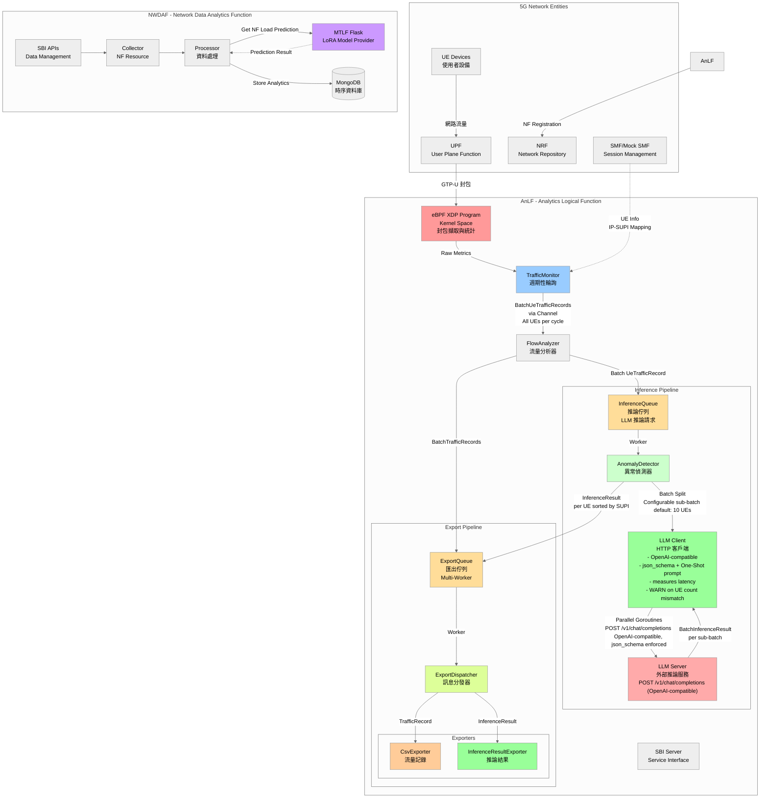
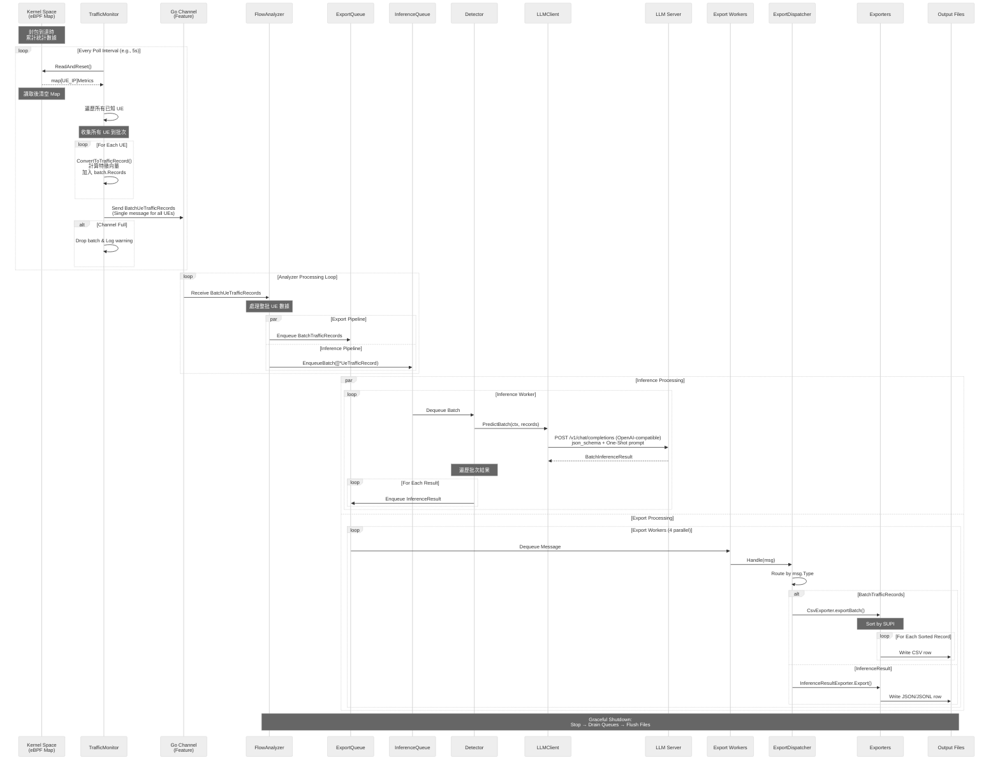
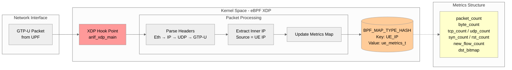
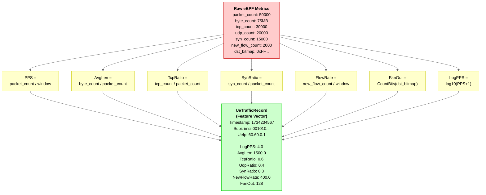
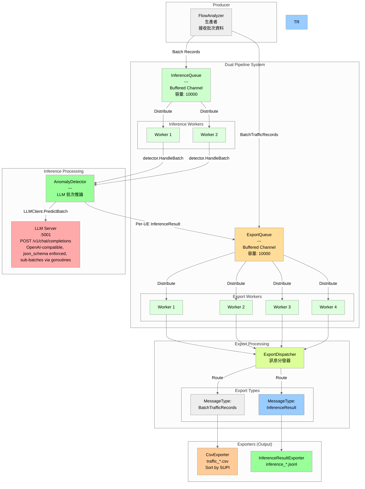
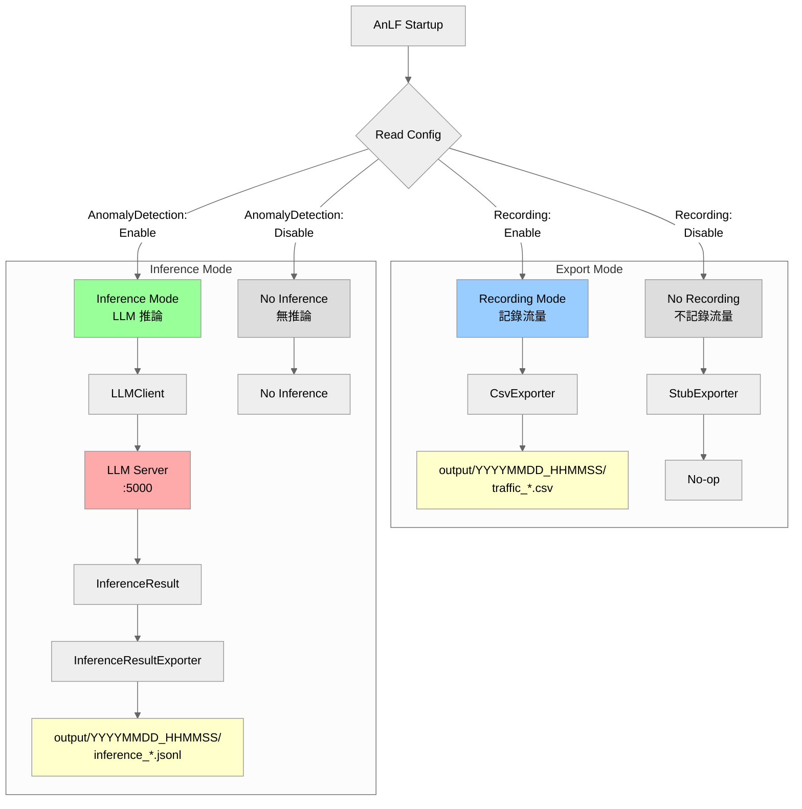
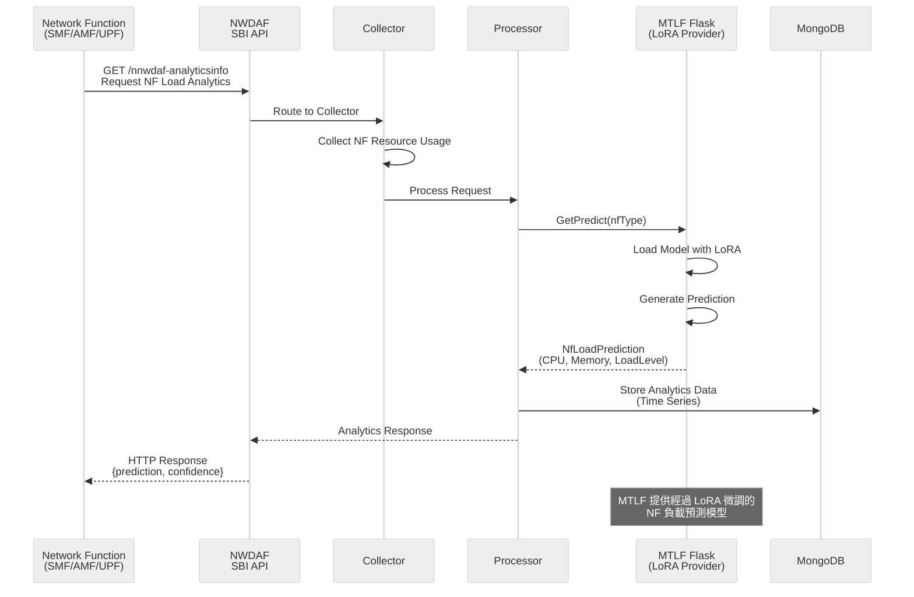
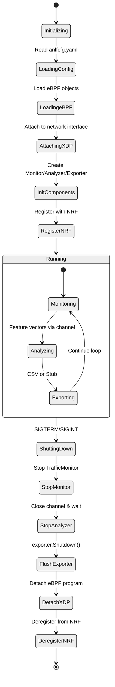

# AnLF 系統架構與資料流向

## 1. 系統總覽 (System Overview)



## 2. AnLF 內部資料流管道 (Internal Data Pipeline)



## 3. eBPF 資料收集層 (eBPF Data Collection Layer)



## 4. 特徵工程轉換 (Feature Engineering)



## 5. Message Queue 架構 (Message Queue Architecture - Dual Pipeline)

### 5.1 Export Queue 與 Inference Queue 雙管道



### 5.2 Message Types

```go
// ExportMessage - 匯出管道訊息
type ExportMessage struct {
    Type MessageType  // "traffic_record" 或 "inference_result"
    Data interface{}  // 實際資料
}

// MessageType - 訊息類型
const (
    MessageTypeTrafficRecord    = "traffic_record"      // 流量記錄
    MessageTypeInferenceResult  = "inference_result"    // 推論結果
)
```

### 5.3 特性

#### Export Queue
- **用途**: 匯出流量記錄和推論結果
- **容量**: 10000 訊息
- **Workers**: 4 個並行 worker
- **Handler**: ExportDispatcher
- **消費者**: CsvExporter, InferenceResultExporter

#### Inference Queue
- **用途**: 推論佇列
- **容量**: 10000 訊息
- **Workers**: 2 個並行 worker (可調整)
- **Handler**: AnomalyDetector
- **處理**: HTTP POST 到 LLM Server

#### 消息路由

```
FlowAnalyzer
    ├── → ExportQueue
    │       └── ExportDispatcher.Handle()
    │           ├── TrafficRecord → CsvExporter → traffic_*.csv
    │           └── InferenceResult → InferenceResultExporter → inference_*.jsonl
    │
    └── → InferenceQueue (if enabled)
            └── AnomalyDetector.Handle()
                ├── LLMClient.Predict() → LLM Server :5000
                └── InferenceResult → ExportQueue
```

## 6. 雙模式運作流程 (Dual-Mode Operation)



## 7. NWDAF 資料流 (NWDAF Data Flow)



## 8. 系統生命週期管理 (Lifecycle Management)



## 9. 關鍵資料結構 (Key Data Structures)

### eBPF Map Value (Kernel)
```c
struct ue_metrics_t {
    u64 packet_count;      // 總封包數
    u64 byte_count;        // 總位元組數
    u64 tcp_count;         // TCP 封包數
    u64 udp_count;         // UDP 封包數
    u64 icmp_count;        // ICMP 封包數
    u64 syn_count;         // TCP SYN 封包數
    u64 rst_count;         // TCP RST 封包數
    u64 new_flow_count;    // 新連線數
    u64 dst_bitmap;        // 目標 IP 分散度 (Bitmap)
};
```

### Feature Vector (User Space)
```go
type UeTrafficRecord struct {
    Timestamp   int64   // Unix timestamp
    Supi        string  // UE identifier
    UeIp        string  // UE IP address
    
    // Normalized features
    LogPPS      float64 // log10(PPS + 1)
    AvgLen      float64 // Average packet length
    TcpRatio    float64 // TCP packet ratio
    UdpRatio    float64 // UDP packet ratio
    IcmpRatio   float64 // ICMP packet ratio
    SynRatio    float64 // TCP SYN ratio
    RstRatio    float64 // TCP RST ratio
    NewFlowRate float64 // New flows per second
    FanOut      float64 // Destination diversity (0-256)
}
```

### Batch Processing Data Structures
```go
// 批次流量記錄
type BatchUeTrafficRecords struct {
    Records   []*UeTrafficRecord `json:"records"`   // 所有 UE 記錄
    Timestamp int64              `json:"timestamp"` // 批次時戳
    BatchSize int                `json:"batch_size"` // UE 數量
}

// LLM 批次推論請求
type BatchInferenceRequest struct {
    SystemPrompt string              `json:"system_prompt,omitempty"` // 系統提示詞
    Records      []*UeTrafficRecord  `json:"records"`   // 所有 UE 流量記錄
    Timestamp    int64               `json:"timestamp"` // 時戳
    BatchSize    int                 `json:"batch_size"` // UE 數量
}

// LLM 批次推論結果
type BatchInferenceResult struct {
    Results      []*InferenceResult `json:"results"`    // 所有 UE 推論結果
    Timestamp    int64              `json:"timestamp"`  // 時戳
    BatchSize    int                `json:"batch_size"` // UE 數量
    ModelVersion string             `json:"model_version,omitempty"` // 模型版本
}

// 單一 UE 推論結果
type InferenceResult struct {
    UeIp         string  `json:"ue_ip"`          // UE IP
    Supi         string  `json:"supi"`           // UE identifier
    Timestamp    int64   `json:"timestamp"`      // 時戳
    IsAnomaly    bool    `json:"is_anomaly"`     // 是否異常
    AnomalyScore float64 `json:"anomaly_score"` // 0.0-1.0
    Prediction   string  `json:"prediction"`     // "normal" 或 "attack"
    Confidence   float64 `json:"confidence"`     // 0.0-1.0
    ModelVersion string  `json:"model_version"`  // 模型版本
}
```

### Export Message Structure
```go
type ExportMessage struct {
    Type MessageType  // "batch_traffic_records" 或 "inference_result"
    Data interface{}  // 實際資料內容
}

// 範例：批次流量記錄訊息
{
    Type: "batch_traffic_records",
    Data: &BatchUeTrafficRecords{
        Records: []*UeTrafficRecord{
            {Timestamp: 1702649400, Supi: "imsi-001010000000001", UeIp: "60.60.0.1", ...},
            {Timestamp: 1702649400, Supi: "imsi-001010000000002", UeIp: "60.60.0.2", ...},
            ...
        },
        Timestamp: 1702649400,
        BatchSize: 20,
    }
}

// 範例：推論結果訊息（單一 UE）
{
    Type: "inference_result",
    Data: &InferenceResult{
        UeIp:         "60.60.0.1",
        Supi:         "imsi-001010000000001",
        Timestamp:    1702649400,
        IsAnomaly:    true,
        AnomalyScore: 0.85,
        Prediction:   "attack",
        Confidence:   0.92,
        ModelVersion: "v1.0",
    }
}
```

### Configuration (YAML)
```yaml
configuration:
  # ... 其他配置 ...
  
  # 異常檢測配置
  anomalyDetection:
    enable: true                          # 啟用異常檢測
    serverUrl: "http://127.0.0.1:5000"   # LLM 推論伺服器
    timeout: 5                            # 超時時間 (秒)
```

## 10. 效能考量與設計決策

### eBPF 層
- **XDP Hook**: 在網路堆疊最早期攔截封包，延遲最低
- **Per-UE Map**: 使用 HASH Map 支援動態 UE 數量
- **Atomic Updates**: eBPF 內建原子操作，無需額外鎖

### User Space 層
- **Non-blocking Channel**: 防止 eBPF 讀取被阻塞
- **ReadAndReset()**: 原子讀取後清空，避免重複計數
- **Batch Channel**: 128 容量緩衝 (批次模式，每訊息包含多個 UE)
- **Batch Processing**: 所有 UE 數據打包為單一批次，減少通道操作與鎖競爭

### Export Message Queue
- **Large Buffer**: 10000 訊息容量，處理高流量突發
- **Multi-Worker**: 4 個並行 goroutines，提升吞吐量
- **Type-based Routing**: 根據 MessageType 動態分發到不同 exporter
  - `batch_traffic_records`: 批次流量記錄，CsvExporter 按 SUPI 排序後寫入
  - `inference_result`: 單一 UE 推論結果
- **Batch CSV Export**: CsvExporter 接收批次後按 SUPI 排序，確保輸出順序一致
- **Graceful Drain**: 關閉時確保所有佇列訊息都被處理
- **Monitoring**: 每 30 秒報告佇列利用率，超過 80% 發出警告

### Inference Queue (LLM Pipeline)
- **Batch Inference**: 使用 OpenAI-compatible Chat Completions API 批次推論，並可視情況拆分為多個子批次以避免模型輸出截斷或格式錯誤
    - 原架構: N 個 UE × 每秒 → N 個 HTTP 請求/秒
    - 批次架構: N 個 UE × 每秒 → 少量 HTTP 請求/秒（採 sub-batches）
- **Dynamic Batch Size**: 批次大小依實際 UE 數量動態調整，配置參數 `batchSize`（建議 5-10）
- **Endpoint**: 使用 `POST /v1/chat/completions`（OpenAI-compatible），請求中採用 `json_schema` 與 One-Shot system prompt 以強制穩定 JSON 輸出；`max_tokens` 增加以避免截斷
- **Result Distribution**: 批次推論結果（每個子批次）回傳後拆分為個別 UE 結果，逐一寫入 ExportQueue

### 資料完整性
- **Zero-filling**: 沒有流量的 UE 也會產生零值記錄
- **Graceful Shutdown**: 確保 CSV 完整 flush，無資料遺失
- **Queue Persistence**: 關閉時先停止生產者，再 drain 完所有訊息

---

---

## 補充說明

### AnLF 當前實作狀態

#### ✅ 已完全實作

1. **eBPF 層**
   - XDP Hook 在 UPF GTP-U 流量上
   - Per-UE 流量統計與特徵萃取
   - 原子操作確保資料一致性

2. **TrafficMonitor**
   - 定期輪詢 eBPF Map (預設 1-5 秒)
   - 特徵向量計算與正規化
   - Go Channel 生產者

3. **FlowAnalyzer**
   - 特徵向量消費者
   - 雙管道分發:
     - ExportQueue: 流量記錄
     - InferenceQueue: LLM 推論請求

4. **ExportQueue & ExportDispatcher**
   - 10000 容量 buffered channel
   - 4 個並行 worker
   - 訊息類型路由
   - CsvExporter (流量記錄)
   - InferenceResultExporter (推論結果)

5. **InferenceQueue & AnomalyDetector** ✨ **批次處理**
   - 10000 容量 buffered channel
   - 2 個並行 worker (可配置)
   - LLMClient HTTP 客戶端
    - 向外部 LLM Server POST /v1/chat/completions (OpenAI-compatible, json_schema enforced)
    - 請求可包含多個 UE（或拆分為子批次），以平衡 token 數與模型穩定性
   - 結果逐一寫回 ExportQueue

6. **配置系統**
   - YAML 配置文件
   - anomalyDetection 段落:
     - enable: 啟用/停用
     - serverUrl: LLM 伺服器地址
     - timeout: 推論超時

7. **生命週期管理**
   - Graceful shutdown
   - 隊列完整排空
   - 檔案完整 flush

8. **完整測試** ✨ **新**
   - BaseQueue 測試 (4 tests)
   - ExportQueue 測試 (4 tests)
   - InferenceQueue 測試 (2 tests)
   - LLMClient 測試 (5 tests)
   - AnomalyDetector 測試 (3 tests)
   - **總計 18 個測試全通過**

#### 📋 組件清單

| 組件 | 狀態 | 說明 |
|------|------|------|
| eBPF XDP | ✅ | 核心封包擷取層 |
| TrafficMonitor | ✅ | 特徵監控與計算 |
| FlowAnalyzer | ✅ | 雙管道分發 |
| ExportQueue | ✅ | 匯出佇列 |
| ExportDispatcher | ✅ | 訊息路由 |
| CsvExporter | ✅ | CSV 匯出 |
| InferenceQueue | ✅ | 推論佇列 |
| AnomalyDetector | ✅ | LLM 推論 |
| LLMClient | ✅ | HTTP 客戶端 |
| InferenceResultExporter | ✅ | 推論結果匯出 |
| LifecycleManager | ✅ | 優雅關閉 |

#### 🔧 配置要點

```yaml
anomalyDetection:
  enable: true                            # 啟用異常檢測
  serverUrl: "http://127.0.0.1:5000"     # LLM 服務地址
  timeout: 5                              # 請求超時 (秒)
  batchSize: 5                            # 最佳批次大小 (5-10 UEs)
  systemPromptPath: ./prompts/anomaly_detection_basic.txt
```

**效能優化特性** ✨ **最新版本 (2025-12-15)**

1. **批次分割 (Batch Splitting)**
   - 大批次 (例如 20 UEs) 自動分割為小批次 (5 UEs)
   - 避免小型 LLM (Qwen 2.5 1.5B) 因批次過大導致格式錯誤
   - 可透過 `batchSize` 配置調整 (建議 5-10)

2. **並行處理 (Parallel Processing with Goroutines)**
   - 多個子批次同時發送到 LLM 伺服器
   - 顯著降低總推論延遲 (20 UEs: 從 ~2s 降至 ~500ms)
   - 每個 goroutine 使用獨立的 context 和 timeout

3. **Fail-Open 機制**
   - LLM 推論失敗時自動返回 "Normal" 預設結果
   - 避免網路流量因推論錯誤而中斷
   - 記錄錯誤但繼續運作，確保系統可用性

4. **結果排序 (SUPI-based Sorting)**
   - 推論結果按 SUPI 排序後輸出
   - 確保輸出檔案順序一致，便於分析

**啟用異常檢測的步驟:**
1. 修改 config/anlfcfg.yaml:
     ```yaml
     anomalyDetection:
         enable: true
         serverUrl: "http://127.0.0.1:5000"   # OpenAI-compatible LLM server base URL
         timeout: 5
         batchSize: 10                         # 子批次大小（建議 5-10）
     ```

2. 啟動 LLM 推論伺服器:
    ```bash
    # 服務必須在指定地址監聽
    # 實作 POST /v1/chat/completions 端點 (OpenAI-compatible Chat Completions)
    # 實作 GET /health 端點
   
    # 範例：啟動 mock LLM server
    cd test_LLM_server
    python3 llm_server.py 5001
    ```

3. 啟動 AnLF:
   ```bash
   ./bin/anlf -cfg config/anlfcfg.yaml
   ```

### 資料流完整版本

```
[GTP-U Packets from UPF]
        ↓
    [eBPF XDP]
        ↓
    [eBPF Map: UE → Metrics]
        ↓
[TrafficMonitor - Poll Every 1-5s]
        ↓ (收集所有 UE 為單一批次)
    [Feature Channel] (capacity: 128, BatchUeTrafficRecords)
        ↓
[FlowAnalyzer - Process Batch]
    ├─→ [ExportQueue] (BatchTrafficRecords 消息)
    │       ├─ 4 Workers → [ExportDispatcher] 
    │       │   ├─→ BatchTrafficRecords → [CsvExporter]
    │       │   │       └─→ Sort by SUPI → traffic_*.csv
    │       │   └─→ InferenceResult → [InferenceResultExporter] → inference_*.jsonl
    │       └─ Buffered Channel (capacity: 10000)
    │
    └─→ [InferenceQueue] (if enabled, []*UeTrafficRecord)
            ├─ 2 Workers → [AnomalyDetector.HandleBatch]
            │   ├─→ [LLMClient.PredictBatch]
            │   │       └─→ POST http://127.0.0.1:5001/v1/chat/completions
            │   │           (OpenAI-compatible; supports json_schema, One-Shot; sub-batches possible)
            │   │           ↓
            │   │       [LLM Server]
            │   │           ↓
            │   │       BatchInferenceResult
            │   │           ↓
            │   │       逐一拆分為 InferenceResult
            │   └─→ [ExportQueue] (feedback loop, per UE)
            └─ Buffered Channel (capacity: 10000)
```

### NWDAF & MTLF
- **MTLF 角色**: 提供經過 LoRA 微調的 NF 負載預測模型
- **主要用途**: 預測 5G Network Functions (SMF/AMF/UPF) 的資源使用狀況
- **預測指標**: CPU Usage, Memory Usage, Load Level Average/Peak
- **模型架構**: Flask Server + LoRA Fine-tuned Models

---